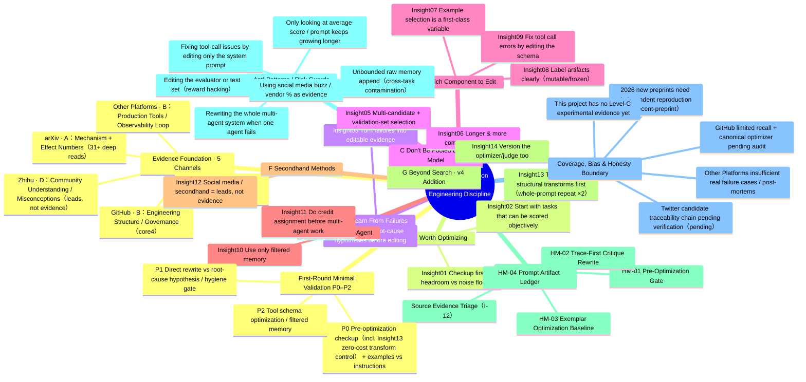
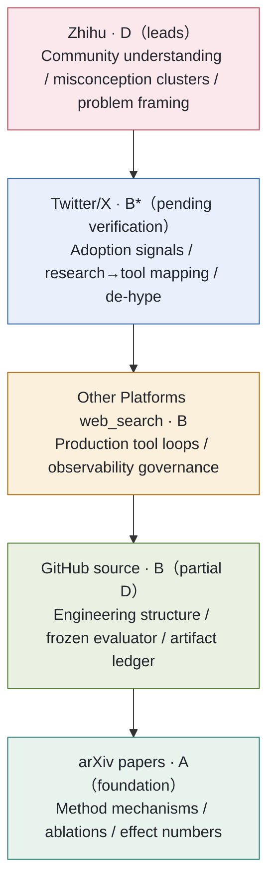
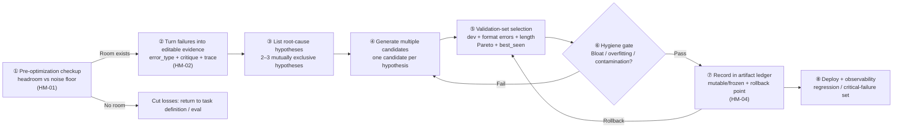

# Prompt Optimization & Self-Evolving · Cross-Channel Panoramic Mind Map (Mermaid Source)

Date: 2026-06-10 (Updated 2026-06-11 to follow main report v4 structure: added Group G and insight nodes 13/14; Groups A–F unchanged)

This file was originally the **editable text version** of the SVG mind map embedded in [`analysis_report_v3_20260610.html`](./analysis_report_v3_20260610.html), and has since been updated to the 14-insight structure of [`analysis_report_v4_20260611.html`](./analysis_report_v4_20260611.html) (the v3 embedded SVG retains the old 12-insight structure and is frozen together with v3). Mermaid renders directly in GitHub and most Markdown previewers; edit here to rearrange the mind map, then redraw the SVG as needed.

One-line thesis: Automatically optimizing prompts is an **engineering discipline** of "decide if it's worth it → turn failures into editable evidence → multi-candidate + validation-set selection → rollback-ready" — not asking the model to polish a prompt.

---

## 1. Panoramic Mind Map (mindmap)

---

## 2. Cross-Channel Evidence Pyramid (How Evidence Stacks Up)

The lower the layer, the closer to first-hand mechanism evidence (strongest, most traceable); the higher the layer, the more it leans toward propagation signals. An insight is more credible when it can be independently supported by multiple layers; upper layers alone are insufficient to support strong conclusions.

---

## 3. Engineering Discipline Loop (Minimal Skeleton for One Prompt Optimization Run)

---

## Maintenance Notes

- The panoramic mind map is organized to match the v4 report (③ workflow insights A–G, 14 total); the evidence pyramid and engineering discipline loop are unchanged from v3/v4.  After any edit, sync the corresponding section of the report.
- Node labels should stay consistent with the I-01..I-14 / HM-01..04 / C-01..06 naming in [`insight_method_catalog_20260609.md`](./insight_method_catalog_20260609.md) to avoid divergence.
- Embedded SVGs are generated by a one-off layout script; to redraw, rearrange nodes following this file's structure.
