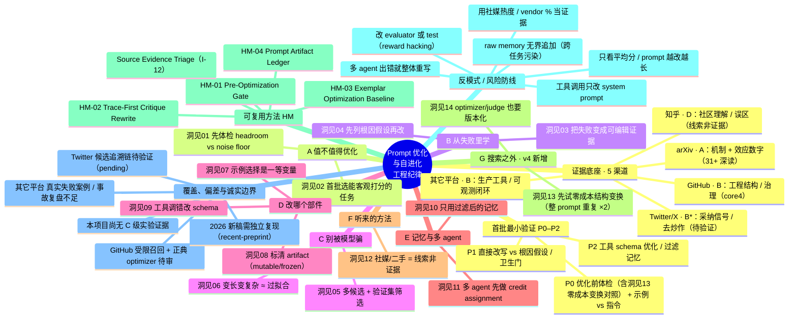
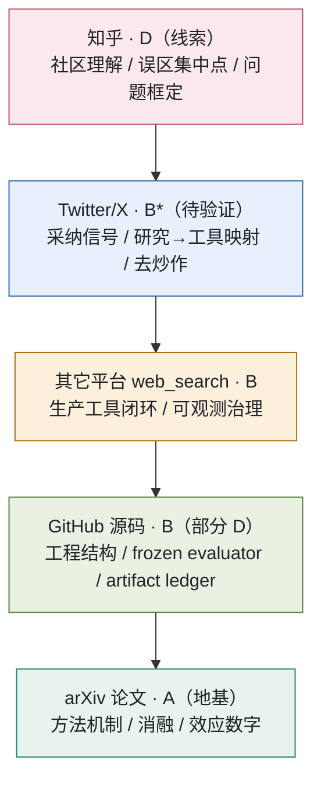
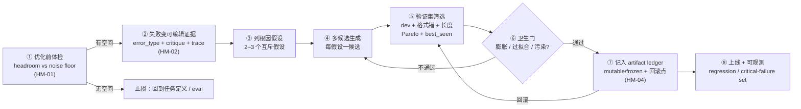

# Prompt 优化与自进化 · 跨渠道全景脑图（Mermaid 源）

日期：2026-06-10（2026-06-11 按主报告 v4 结构更新：新增 G 组与洞见 13/14 节点，A–F 未动）

本文件最初是 [`analysis_report_v3_20260610.html`](./analysis_report_v3_20260610.html) 内嵌 SVG 脑图的**可编辑文本版**，现已按 [`analysis_report_v4_20260611.html`](./analysis_report_v4_20260611.html) 的 14 洞见结构更新（v3 内嵌 SVG 仍为 12 洞见旧结构，随 v3 一起冻结）。Mermaid 在 GitHub / 多数 Markdown 预览器中可直接渲染；改这里即可重排脑图，再按需重绘 SVG。

一句话总论：自动优化 prompt 是「先判断值不值得 → 把失败变成可编辑证据 → 多候选 + 验证集筛选 → 可回滚」的**工程纪律**，不是让模型把 prompt 润色一遍。

---

## 1. 全景脑图（mindmap）

---

## 2. 跨渠道证据金字塔（证据怎么叠起来）

越靠下越接近一手机制证据（最强、最可追溯），越靠上越偏传播信号。一条洞见越能被多层独立支撑越可信；上层单独不足以支撑强结论。

---

## 3. 工程纪律闭环（一条 prompt 优化运行的最小骨架）

---

## 维护说明

- 全景脑图已按 v4 报告（③ 工作流洞见 A–G 共 14 条）口径组织；证据金字塔与工程纪律闭环两图与 v3/v4 同口径未变。改动后请同步报告对应小节。
- 节点文案应与 [`insight_method_catalog_20260609.md`](./insight_method_catalog_20260609.md) 的 I-01..I-14 / HM-01..04 / C-01..06 命名保持一致，避免「各说各话」。
- 内嵌 SVG 由一次性布局脚本生成；如需重绘，按本文件结构重排节点即可。
